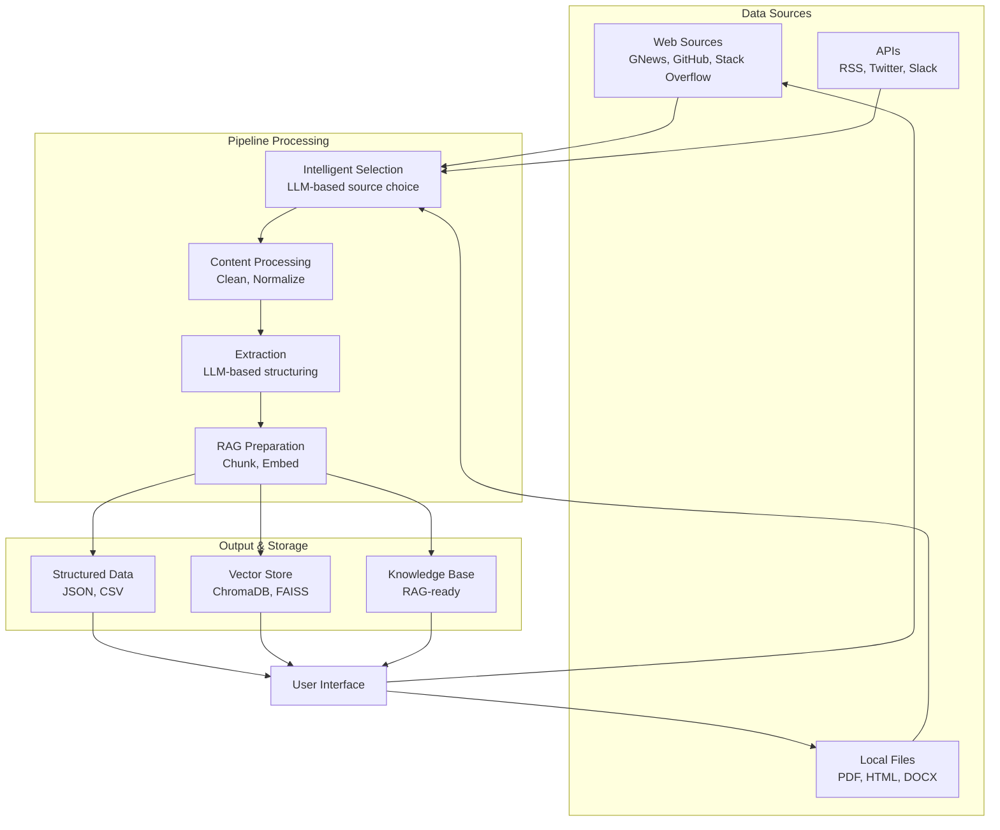

# Webis: AI-Driven Knowledge Pipeline

[中文](README.zh.md)

[](https://www.python.org/)
[](LICENSE)
[](https://pypi.org/project/webis/)
[](https://narwhal-lab.github.io/webis)
[](https://github.com/Narwhal-Lab/Webis/actions)
[](https://codecov.io/gh/Narwhal-Lab/Webis)
[](https://github.com/astral-sh/ruff)

**Webis** is a comprehensive, modular framework that powers the next generation of AI applications. It connects diverse data sources (Web, SaaS, databases, etc.) to Large Language Models (LLMs) through a robust pipeline of collection, processing, and extraction.

## 🎯 Who is Webis for?

| 👥 **User Type** | 🚀 **Use Case** |
|---|---|
| **Researchers** | Literature reviews, data collection, research analysis |
| **Data Scientists** | Training data preparation, knowledge base building |
| **Developers** | Building AI applications, integrating RAG capabilities |
| **Business Users** | Market monitoring, competitive intelligence, knowledge management |
| **Educators** | Creating educational resources, research datasets |

## ✨ Key Features

### For All Users

- **🎯 5-Minute Setup**: Get started in minutes with our intuitive CLI and web interface
- **📊 Beautiful Visualizations**: Interactive dashboard with charts and graphs
- **🤖 AI Assistant**: Natural language interaction with your knowledge base
- **📄 Multi-format Support**: PDFs, webpages, HTML, Markdown, CSV, JSON, DOCX

### For Developers

- **🔌 Plugin Architecture**: Everything is a plugin (sources, processors, extractors)
- **🛠️ SDK & API**: Clean Python API for integration into your applications
- **🧪 Testing Suite**: Comprehensive test coverage with pytest
- **📚 Rich Documentation**: Detailed API docs and examples

### For Power Users

- **🤖 Intelligent Crawler**: LLM-powered source selection and query generation
- **⚡ RAG-Ready**: Built-in cleaning, chunking, and embedding generation
- **🔍 Advanced Search**: Vector search, keyword search, and hybrid retrieval
- **📈 Monitoring**: Real-time pipeline tracking and performance metrics

## 🚀 Quick Start

### Installation

**Option 1: One-Command Setup (Recommended)**

```bash
# Automatic setup with conda
bash setup/conda_setup.sh

# Or with uv
bash setup/uv_setup.sh
```

**Option 2: Manual Installation**

```bash
# Clone the repository
git clone https://github.com/Narwhal-Lab/Webis.git
cd webis

# Install the package
pip install -e .
```

**Option 3: Docker**

```bash
# Quick start with Docker
docker-compose up

# For production
docker-compose -f docker-compose.prod.yml up -d
```

### First Run

#### 1. Simple Web Data Collection

```bash
# Get the latest news about AI
webis run "Latest artificial intelligence news" --limit 5
```

#### 2. Local Document Processing

```bash
# Extract information from a PDF
webis extract ./research.pdf --task "Extract key findings"
```

#### 3. Launch Web Interface

```bash
# Open the visualizer
webis visualizer
```

## 📚 Getting Started Guides

| Guide | Description | Target Audience |
|---|---|---|
| [Quick Start Guide](docs/quickstart.md) | 5 minutes to first result | All users |
| [User Guide](docs/user-guide.md) | Complete feature walkthrough | Regular users |
| [API Reference](docs/api.md) | Full API documentation | Developers |
| [Plugin Development](docs/plugins.md) | Create custom plugins | Advanced users |
| [Deployment Guide](docs/deployment.md) | Production deployment | System admins |

## 🛠️ Usage Examples

### Basic Web Scraping

```bash
# Search and collect data from multiple sources
webis run "Machine learning research papers" \
  --sources semantic_scholar,arxiv \
  --limit 10 \
  --output ml_papers
```

### Building a Knowledge Base

```bash
# Create a RAG knowledge base
webis run "Recent developments in quantum computing" \
  --rag-mode \
  --chunk-size 1000 \
  --embed-model all-MiniLM-L6-v2
```

### Custom Data Processing

```bash
# Process local files with custom schema
webis extract ./financial_reports.pdf \
  --schema ./schemas/financial_report.json \
  --output structured_data.json
```

### Batch Processing

```bash
# Process multiple files
webis batch process ./documents/ \
  --task "Extract entities" \
  --output ./processed/
```

## 🏗️ Architecture



## 🔌 Plugin System

Webis is built around a powerful plugin architecture:

### Data Source Plugins

- `semantic_scholar` - Academic papers
- `github` - GitHub repositories
- `gnews` - Google News
- `reddit` - Reddit discussions
- `hackernews` - Hacker News

### Processing Plugins

- `html_cleaner` - HTML content cleaning
- `pdf_processor` - PDF text extraction
- `chunking` - Document chunking strategies
- `ocr` - Image text extraction

### Extraction Plugins

- `llm_extractor` - LLM-based data extraction
- `pii_redactor` - PII removal
- `sentiment_analysis` - Sentiment scoring

## 📖 Documentation

- 📖 [User Documentation](docs/)
- 🔌 [Plugin Development Guide](docs/plugins.md)
- 🏗️ [API Reference](docs/api.md)
- 🚀 [Deployment Guide](docs/deployment.md)
- 🤝 [Contributing Guide](CONTRIBUTING.md)

## 🧪 Examples

Explore our [examples](examples/) directory:

- [Basic Web Scraping](examples/basic/web_scraping.py)
- [Custom Plugin Development](examples/developer/custom_plugin.py)
- [Enterprise Knowledge Base](examples/enterprise/knowledge_base.py)
- [API Integration](examples/developer/api_client.py)

## 🤝 Community & Support

- 📚 [Documentation](https://narwhal-lab.github.io/webis)
- 🐛 [Bug Reports](https://github.com/Narwhal-Lab/Webis/issues)
- 💬 [Discussions](https://github.com/Narwhal-Lab/Webis/discussions)
- 💬 [Discord Chat](https://discord.gg/webis)
- 📧 [Email Support](mailto:contact@webis.dev)

## 📝 Roadmap

- [ ] v2.0.0 - Stable Release
  - [ ] Enterprise features
  - [ ] Advanced caching
  - [ ] Multi-tenant support
  - [ ] Enhanced security
- [ ] v2.1.0 - Enhanced AI
  - [ ] Multi-modal support
  - [ ] Agent capabilities
  - [ ] Auto-scaling
- [ ] v2.2.0 - Ecosystem
  - [ ] Marketplace for plugins
  - [ ] Integration SDKs
  - [ ] Monitoring dashboard

## 📜 License

This project is licensed under the **Apache 2.0 License** - see the [LICENSE](LICENSE) file for details.

## 🌟 Star History

[](https://star-history.com/#Narwhal-Lab/Webis&Date)

---

<div align="center">
Made with ❤️ by the Webis Team<br>
🌐 [website](https://webis.dev) | 📧 [contact](mailto:contact@webis.dev)
</div>
