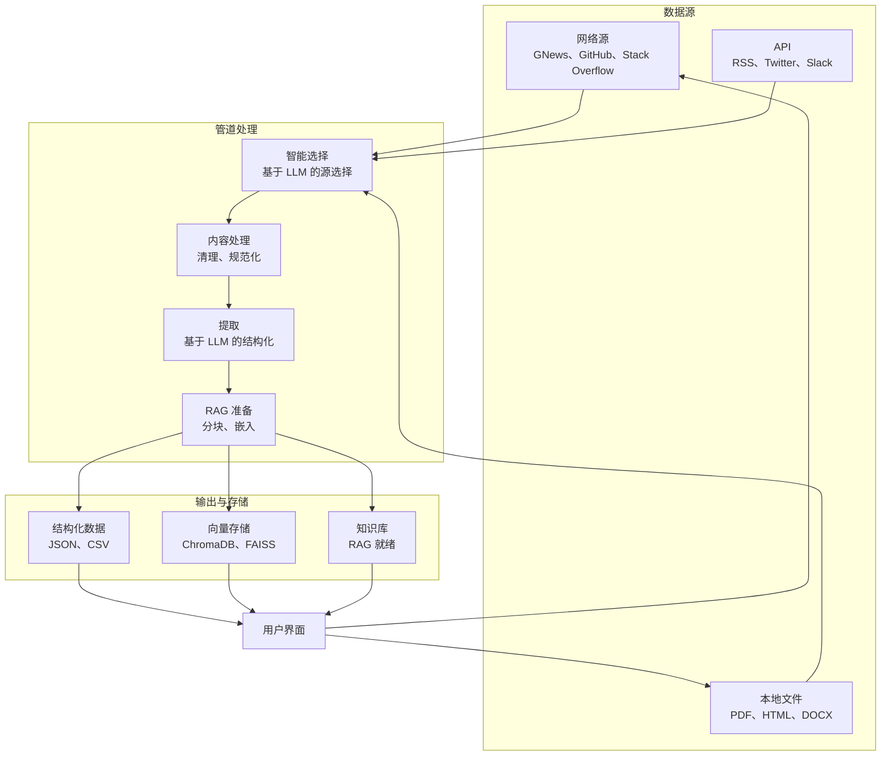

# Webis: AI 驱动的知识管道

[](https://www.python.org/)
[](LICENSE)
[](https://pypi.org/project/webis/)
[](https://narwhal-lab.github.io/webis)
[](https://github.com/Narwhal-Lab/Webis/actions)
[](https://codecov.io/gh/Narwhal-Lab/Webis)
[](https://github.com/astral-sh/ruff)

**Webis** 是一个全面的模块化框架，为下一代 AI 应用提供动力。它通过强大的收集、处理和提取管道，将多样化的数据源（网络、SaaS、数据库等）连接到大型语言模型（LLMs）。

## 🎯 适合哪些用户？

| 👥 **用户类型** | 🚀 **使用场景** |
|---|---|
| **研究人员** | 文献综述、数据收集、研究分析 |
| **数据科学家** | 训练数据准备、知识库构建 |
| **开发者** | 构建 AI 应用、集成 RAG 功能 |
| **企业用户** | 构建企业知识库、监控市场动态 |
| **教育工作者** | 创建教育资源、研究数据集 |

## ✨ 主要功能

### 适用于所有用户
- **🎯 5分钟快速上手**：通过直观的 CLI 和 Web 界面快速开始
- **📊 美观的可视化**：带有图表和图形的交互式仪表板
- **🤖 AI 助手**：与知识库的自然语言交互
- **📄 多格式支持**：PDF、网页、HTML、Markdown、CSV、JSON、DOCX

### 适用于开发者
- **🔌 插件架构**：一切都是插件（数据源、处理器、提取器）
- **🛠️ SDK & API**：用于集成到应用程序的清晰 Python API
- **🧪 测试套件**：使用 pytest 的全面测试覆盖
- **📚 丰富的文档**：详细的 API 文档和示例

### 适用于高级用户
- **🤖 智能爬虫**：基于 LLM 的源选择和查询生成
- **⚡ RAG 就绪**：内置的清理、分块和嵌入生成
- **🔍 高级搜索**：向量搜索、关键词搜索和混合检索
- **📈 监控**：实时管道跟踪和性能指标

## 🚀 快速开始

### 安装

**选项 1：一键设置（推荐）**
```bash
# 使用设置脚本
bash setup/conda_setup.sh

# 或者使用 uv
bash setup/uv_setup.sh
```

**选项 2：手动安装**
```bash
# 克隆并安装
git clone https://github.com/Narwhal-Lab/Webis.git
cd webis

# 安装包
pip install -e .
```

**选项 3：Docker**
```bash
# 使用 Docker Compose 快速启动
docker-compose up

# 后台模式
docker-compose -f docker-compose.prod.yml up -d
```

### 首次运行

#### 1. 简单网络数据收集
```bash
# 获取最新的 AI 新闻
webis run "最新的 AI 新闻" --limit 5
```

#### 2. 本地文档处理
```bash
# 从 PDF 中提取信息
webis extract ./report.pdf --task "提取财务摘要"
```

#### 3. 启动 Web 界面
```bash
# 打开可视化器
webis visualizer
```

## 📚 入门指南

| 指南 | 描述 | 目标用户 |
|---|---|---|
| [快速开始指南](docs/quickstart.md) | 5分钟内获得第一个结果 | 所有用户 |
| [用户指南](docs/user-guide.md) | 完整功能指南 | 普通用户 |
| [API 参考](docs/api.md) | 完整 API 文档 | 开发者 |
| [插件开发](docs/plugins.md) | 创建自定义插件 | 高级用户 |
| [部署指南](docs/deployment.md) | 生产部署 | 系统管理员 |

## 🛠️ 使用示例

### 基础网络爬取
```bash
# 从多个来源搜索和收集数据
webis run "机器学习研究论文" \
  --sources semantic_scholar,arxiv \
  --limit 10 \
  --output ml_papers
```

### 构建知识库
```bash
# 创建 RAG 知识库
webis run "最近的量子计算发展" \
  --rag-mode \
  --limit 10
```

### 自定义数据处理
```bash
# 使用自定义模式处理本地文件
webis extract ./financial_reports.pdf \
  --schema ./schemas/financial_report.json \
  --output structured_data.json
```

### 批量处理
```bash
# 处理多个文件
webis batch process ./documents/ \
  --task "提取实体" \
  --output ./processed/
```

## 🏗️ 架构



## 🔌 插件系统

Webis 建立在强大的插件架构之上：

### 数据源插件
- `duckduckgo` - DuckDuckGo 搜索
- `semantic_scholar` - 学术论文
- `github` - GitHub 仓库
- `gnews` - Google News
- `reddit` - Reddit 讨论
- `hackernews` - Hacker News

### 处理插件
- `html_cleaner` - HTML 内容清理
- `pdf_processor` - PDF 文本提取
- `chunking` - 文档分块策略
- `ocr` - 图像文本提取

### 提取插件
- `llm_extractor` - LLM 基础数据提取
- `pii_redactor` - PII 移除
- `sentiment_analysis` - 情感评分

## 📖 文档

- 📖 [用户文档](docs/)
- 🔌 [插件开发指南](docs/plugins.md)
- 🏗️ [API 参考](docs/api.md)
- 🚀 [部署指南](docs/deployment.md)
- 🤝 [贡献指南](CONTRIBUTING.md)

## 🧪 示例

探索我们的 [examples](examples/) 目录：

- [基础网络爬取](examples/basic/web_scraping.py)
- [自定义插件开发](examples/developer/custom_plugin.py)
- [企业知识库](examples/enterprise/knowledge_base.py)
- [API 集成](examples/developer/api_client.py)

## 🤝 社区与支持

- 📚 [文档](https://narwhal-lab.github.io/webis)
- 🐛 [报告问题](https://github.com/Narwhal-Lab/Webis/issues)
- 💬 [讨论](https://github.com/Narwhal-Lab/Webis/discussions)
- 💬 [Discord 聊天](https://discord.gg/webis)
- 📧 [邮件支持](mailto:contact@webis.dev)

## 📝 路线图

- [ ] v2.0.0 - 稳定版本
  - [ ] 企业功能
  - [ ] 高级缓存
  - [ ] 多租户支持
  - [ ] 增强安全性
- [ ] v2.1.0 - 增强 AI
  - [ ] 多模态支持
  - [ ] 代理功能
  - [ ] 自动扩展
- [ ] v2.2.0 - 生态系统
  - [ ] 插件市场
  - [ ] 集成 SDK
  - [ ] 监控仪表板

## 📜 许可证

本项目采用 **Apache 2.0 许可证** - 详见 [LICENSE](LICENSE) 文件。

## 🌟 Star 历史记录

[](https://star-history.com/#Narwhal-Lab/Webis&Date)

---

<div align="center">
由 Webis 团队精心制作 ❤️<br>
🌐 [网站](https://webis.dev) | 📧 [联系](mailto:contact@webis.dev)
</div>